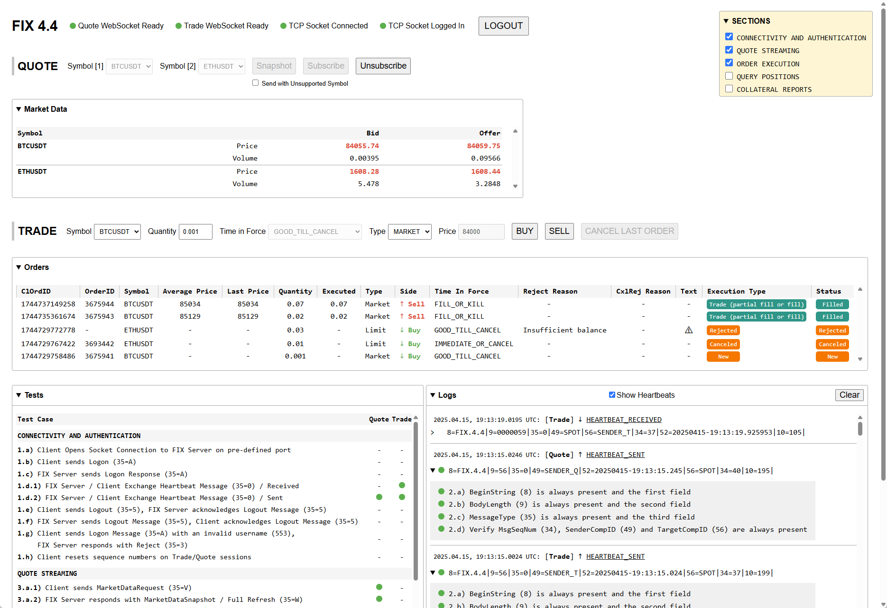

# FIX protocol Node.js client

A Node.js FIX client that enables communication with FIX servers for trading and market data operations. It acts as an initiator in the FIX protocol, establishing connections, sending messages, and receiving responses according to the [`FIX 4.4 specification`](https://www.fixtrading.org/standards/fix-4-4/) standards.

On the frontend, a React application is designed for manual testing of various FIX protocol endpoints, which can be helpful during the onboarding process.

### Key Components

1. Session Management

   - Handles TCP/IP connections to FIX servers
   - Manages login/logout sequences
   - Maintains heartbeat intervals
   - Processes session-level messages

2. Message Processing

   - Constructs FIX messages following 4.4 specification
   - Parses incoming FIX messages
   - Validates message format and content

3. Protocol Compliance

   - Implements required fields and tags
   - Maintains proper message structure
   - Handles checksum validation
   - Supports mandatory message types

### Message Types

- Logon (35=A)
- Heartbeat (35=0)
- Logout (35=5)
- Execution Report (35=8)
- New Order Single (35=D)
- Order Cancel Request (35=F)
- Market Data Request (35=V)
- Collateral Inquiry (35=BB)
- Request For Positions (35=AN)

## Usage

#### Server ([Express](https://expressjs.com/))

1. Open the `/server` folder from terminal.
2. Run `npm install` to install all the dependencies.
3. Obtain the connection settings (host/port) and authentication credentials from the remote FIX provider.

   - Create an empty `.env` file and copy the contents of `.env.example`.
   - Update the `FIX trading connection` and `FIX market data connection` keys.

   Note: To connect to the [`Binance FIX Api`](https://developers.binance.com/docs/binance-spot-api-docs/testnet/fix-api), first generate an Ed25519 public key pair as described on [`testnet.binance.vision`](https://testnet.binance.vision/), then update the `BINANCE_PRIVATE_KEY` in `.env`.

4. Run `npm run dev` to start the server.

#### Client ([React](https://react.dev/), [Vite](https://vite.dev/))

1. Open the `/client` folder from terminal.
2. Run `npm install` to install all the dependencies.
3. Create an empty `.env` file and copy the contents of `.env.example`.
4. Run `npm run dev` to start the application .
5. Visit the application at [`http://localhost:5173/`](http://localhost:5173/).
